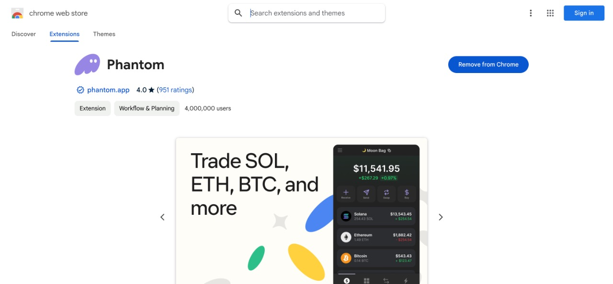
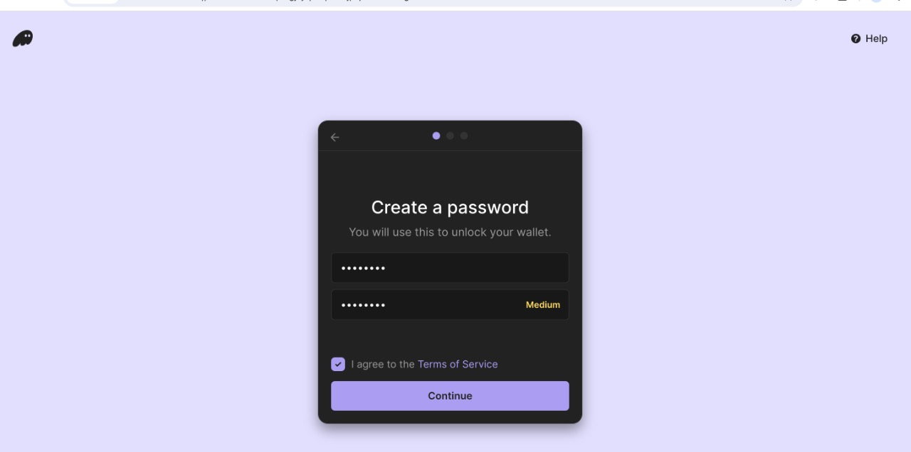
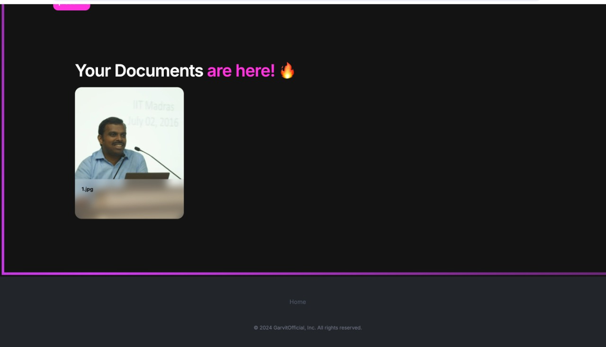

# codevHackathon
# Decentralized Credential Verification System

## Overview

A decentralized application (dApp) designed to securely store and verify academic degrees and professional credentials using blockchain technology. By leveraging smart contracts on the Solana blockchain, this solution ensures that educational records are immutable, tamper-proof, and easily verifiable by employers, institutions, and other third parties.

## Features

- **Secure Storage**: Store academic degrees and credentials on the blockchain, ensuring data integrity and security.
- **Tamper-Proof Records**: Once a degree or credential is added to the blockchain, it cannot be altered or deleted, preventing fraud.
- **Easy Verification**: Employers and institutions can quickly verify the authenticity of a candidate's credentials using a simple search on the blockchain.
- **Universal Accessibility**: Records can be accessed from anywhere, making the process of credential verification seamless and efficient.

## Technologies Used

- **Solana**: The blockchain platform used for deploying smart contracts.
- **Javascript**: The frontend framework used to build the user interface.

## Smart Contract Overview

The smart contract is written and deployed on the Solana network. It includes the following functions:

- **addDegree**: Allows authorized institutions to add a new degree or credential to the blockchain.
- **getDegreeDetails**: Retrieves details of a specific degree, including the issuing institution, date of issuance, and other metadata.

## Link Of Video
- **https://drive.google.com/file/d/1dkg7tEZcb_WmKhe-EUwZ6Ys8rtqegBfo/view?usp=sharing**

## Steps Of Installation
Step1: Use google chrome only in order to download phantom wallet.

